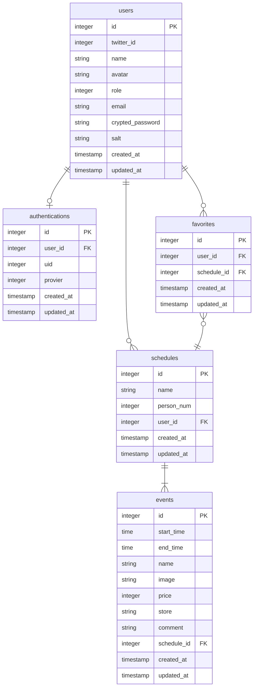

```mermaid
erDiagram

    users ||--o| authentications: ""
    users ||--o{ schedules: ""
    users ||--o{favorites: ""
    favorites }o--||schedules: ""
    schedules ||--|{events: ""

    users {
        integer id "PK"
        integer twitter_id
        string name
        string avatar
        integer role
        string email
        string crypted_password
        string salt
        timestamp created_at
        timestamp updated_at
    }

    authentications {
        integer id "PK"
        integer user_id "FK"
        integer uid
        integer provier
        timestamp created_at
        timestamp updated_at
    }
    schedules {
        integer id "PK"
        string name
        integer person_num
        integer user_id "FK"
        timestamp created_at
        timestamp updated_at
    }

    events {
        integer id "PK"
        time start_time
        time end_time
        string name
        string image
        integer price
        string store
        string comment
        integer schedule_id "FK"
        timestamp created_at
        timestamp updated_at
    }

    favorites {
        integer id "PK"
        integer user_id "FK"
        integer schedule_id "FK"
        timestamp created_at
        timestamp updated_at
    }

    
```